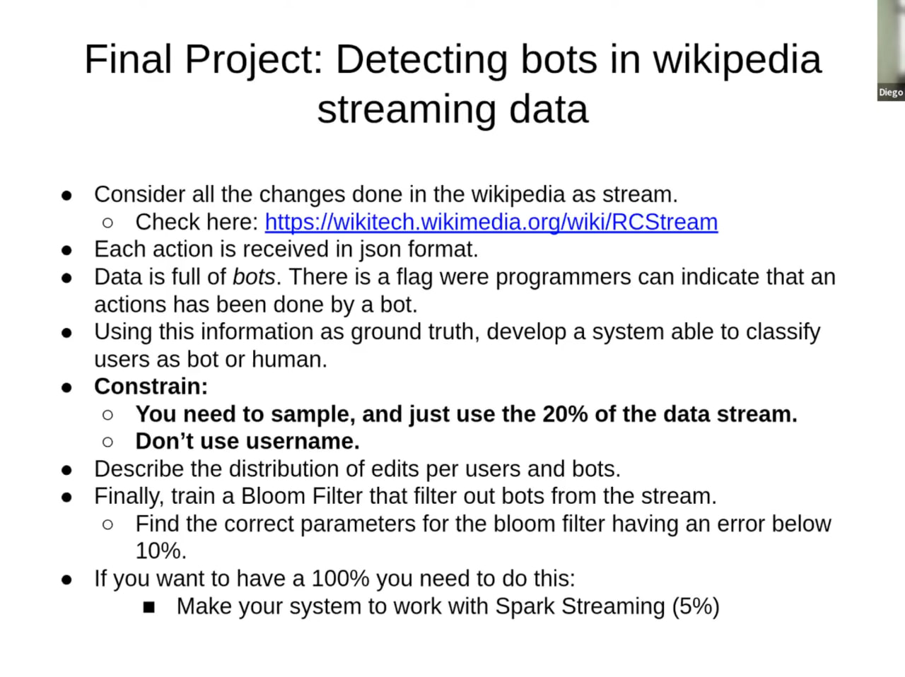
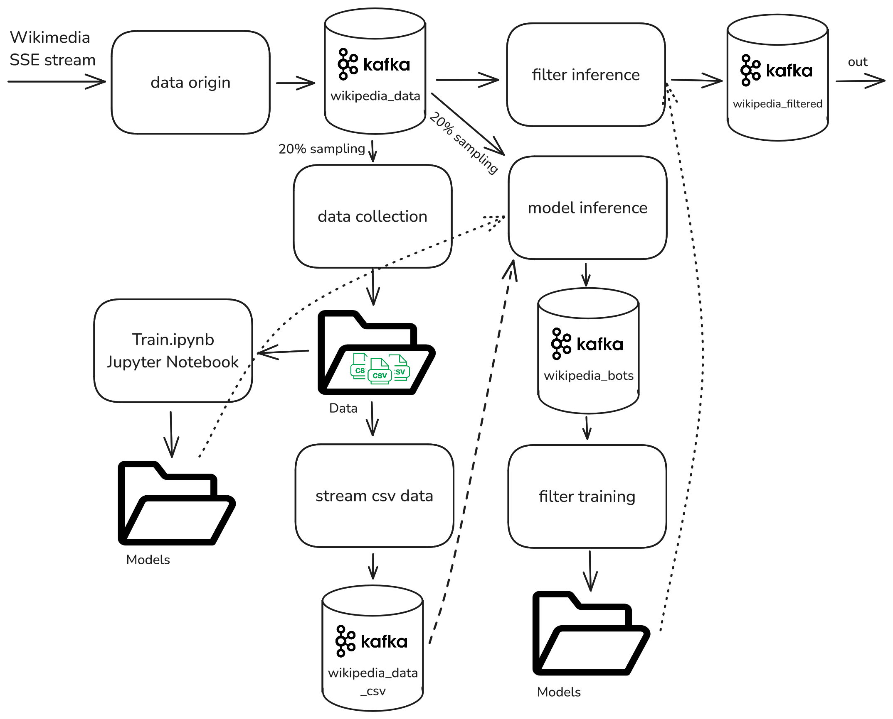
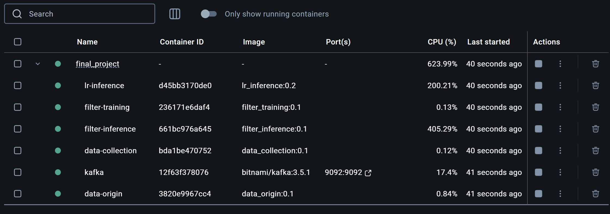

# Final Project on Mining Massive Datasets course

Task for the final project is discribed on the screenshot:



## Setup
1. Install JDK: either like in general Readme, or:
```bash
sudo apt-get install openjdk-8-jdk
```
2. Set `JAVA_HOME` variable to the output of:
```bash
update-alternatives --list java
```
3. Install Spark:
```bash
wget https://downloads.apache.org/spark/spark-3.5.3/spark-3.5.3-bin-hadoop3.tgz
tar xzvf spark-3.5.3-bin-hadoop3.tgz
```
4. Set `SPARK_HOME` environment variable to the location of unpacked `spark-3.5.3-bin-hadoop3.tgz`
5. Install Kafka. We recommend following [this](https://www.linuxtechi.com/how-to-install-apache-kafka-on-ubuntu/) guide, with Kafka 2.12-3.5.1 from [here](https://archive.apache.org/dist/kafka/3.5.1/kafka_2.12-3.5.1.tgz).

## Pipeline description

Our pipeline consists of 6 components, Kafka as a streaming storage, and one Jupyter Notebook; and can be visually described as follows:



### Pipeline components description

Components in the pipiline are:
1. **Data origin**: Python script to convert SSE stream from Wikimedia into a Kafka stream with specific wikipedia's edits.
2. **Data collector**: PySpark script to collect (and possibly sample) data from the Kafka stream into folder with CSV files.
3. **CSV streamer**: Python script to read CSVs from a folder and stream them into Kafka with a desired rate.
4. **Bloom filter inference**: PySpark script to perform inference on an edits stream, and filtering out possible bots.
5. **Model training notebook**: PySpark-based notebook to train a LogisticRegression and Word2Vec-based model, and save it for future usage.
6. **Model inference**: PySpark script to be runned on a sampled stream and to obtain possible bots based on their comments. Streams possible bots to a different stream.
7. **Bloom filter training**: PySpark script that performs recurrent retraining of BloomFilter, making it working only with bots that were active in some period, e.g. one day.

## Pipeline run

### Docker run

The pipeline is dockerized now, and can be run in two steps (after [installing Docker](https://www.docker.com/get-started/) and starting it):
1. Create local docker images of all the components:
```bash
cd final_project
docker build -t filter_inference:0.1 -f filter_inference.Dockerfile .
docker build -t data_origin:0.1 -f data_origin.Dockerfile .
docker build -t lr_inference:0.2 -f lr_inference.Dockerfile .
docker build -t filter_training:0.1 -f filter_training.Dockerfile .
docker build -t data_collection:0.1 -f data_collection.Dockerfile .

```
2. `docker-compose up`

That's it!



### Manual run

Each component can be run separately, so we will leave their running scripts here:
0. Create Kafka topics:
```bash
cd /usr/local/kafka
bin/kafka-topics.sh --create --bootstrap-server localhost:9092 --replication-factor 1 --partitions 1 --topic wikipedia_data
bin/kafka-topics.sh --create --bootstrap-server localhost:9092 --replication-factor 1 --partitions 1 --topic wikipedia_data_csv
bin/kafka-topics.sh --create --bootstrap-server localhost:9092 --replication-factor 1 --partitions 1 --topic wikipedia_bots
bin/kafka-topics.sh --create --bootstrap-server localhost:9092 --replication-factor 1 --partitions 1 --topic wikipedia_filtered
```
1. Data generation:
    - Using current wikipedia stream:
        ```bash
        python components/input/data_origin.py --broker BROKER --topic TOPIC [--server_name SERVER_NAME] [--action_type ACTION_TYPE] [--verbose]
        ```
        For example:
        ```bash
        python components/input/data_origin.py --broker localhost:9092 --topic wikipedia_data --server_name en.wikipedia.org --action_type edit --verbose
        ```
    - Using recorded wikipedia stream:
        ```bash
        python components/input/stream_csv_folder.py --broker BROKER --topic TOPIC --input_folder INPUT_FOLDER [--distribution_scale DISTRIBUTION_SCALE] [--verbose]
        ```
        For example:
        ```bash
        python components/input/stream_csv_folder.py --broker localhost:9092 --topic wikipedia_data_csv --input_folder ./data/train/ --distribution_scale 10. --verbose
        ```
2. Data collection:
    ```bash
    $SPARK_HOME/bin/spark-submit --packages org.apache.spark:spark-sql-kafka-0-10_2.12:3.5.1 --driver-memory DRIVER_MEMORY components/data_collection/data_collection.py --broker BROKER --topic TOPIC [--sampling_freq SAMPLING_FREQ] [--dest_folder DEST_FOLDER]
    ```
    For example:
    ```bash
    $SPARK_HOME/bin/spark-submit --packages org.apache.spark:spark-sql-kafka-0-10_2.12:3.5.1 --driver-memory 2G components/data_collection/data_collection.py --broker localhost:9092 --topic wikipedia_data --sampling_freq 0.3 --dest_folder ./data/train/
    ```
3. Models inference and training:
    - Embedding-based Logistic Regression model inference:
    ```bash
    $SPARK_HOME/bin/spark-submit --packages org.apache.spark:spark-sql-kafka-0-10_2.12:3.5.1,com.johnsnowlabs.nlp:spark-nlp_2.12:5.5.1 --driver-memory DRIVER_MEMORY components/inference/lr_inference.py --broker BROKER --topic_in TOPIC_IN --topic_out TOPIC_OUT --model_path MODEL_PATH [--sampling_freq SAMPLING_FREQ]
    ```
    For example:
    ```bash
    $SPARK_HOME/bin/spark-submit --packages org.apache.spark:spark-sql-kafka-0-10_2.12:3.5.1,com.johnsnowlabs.nlp:spark-nlp_2.12:5.5.1 --driver-memory 10G components/inference/lr_inference.py --broker localhost:9092 --topic_in wikipedia_data --topic_out wikipedia_bots --model_path ./data/logreg/
    ```
    - Bloom filter training:
    ```bash
    $SPARK_HOME/bin/spark-submit --packages org.apache.spark:spark-sql-kafka-0-10_2.12:3.5.1 --driver-memory DRIVER_MEMORY components/inference/filter_training.py --broker BROKER --topic TOPIC --filter_path FILTER_PATH [--train_period TRAIN_PERIOD] [--forget_period FORGET_PERIOD]
    ```
    For example:
    ```bash
    $SPARK_HOME/bin/spark-submit --packages org.apache.spark:spark-sql-kafka-0-10_2.12:3.5.1 --driver-memory 4G components/inference/filter_training.py --broker localhost:9092 --topic wikipedia_bots --filter_path ./data/filter --train_period 30 --forget_period 60
    ```
    - Bloom filter inference:
    ```bash
    $SPARK_HOME/bin/spark-submit --packages org.apache.spark:spark-sql-kafka-0-10_2.12:3.5.1 --driver-memory DRIVER_MEMORY components/inference/filter_inference.py --broker BROKER --topic_in TOPIC_IN --topic_out TOPIC_OUT --filter_path FILTER_PATH [--filter_reload_period FILTER_RELOAD_PERIOD]
    ```
    For example:
    ```bash
    $SPARK_HOME/bin/spark-submit --packages org.apache.spark:spark-sql-kafka-0-10_2.12:3.5.1 --driver-memory 4G components/inference/filter_inference.py --broker localhost:9092 --topic_in wikipedia_data --topic_out wikipedia_filtered --filter_path ./data/filter --filter_reload_period 30
    ```
